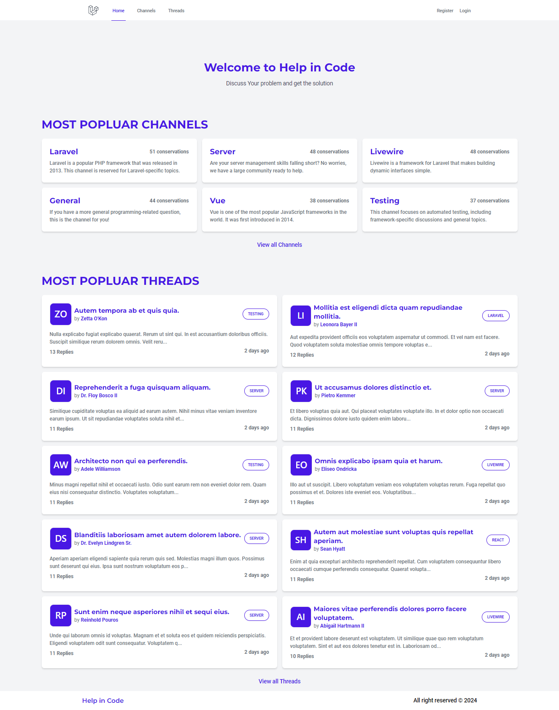
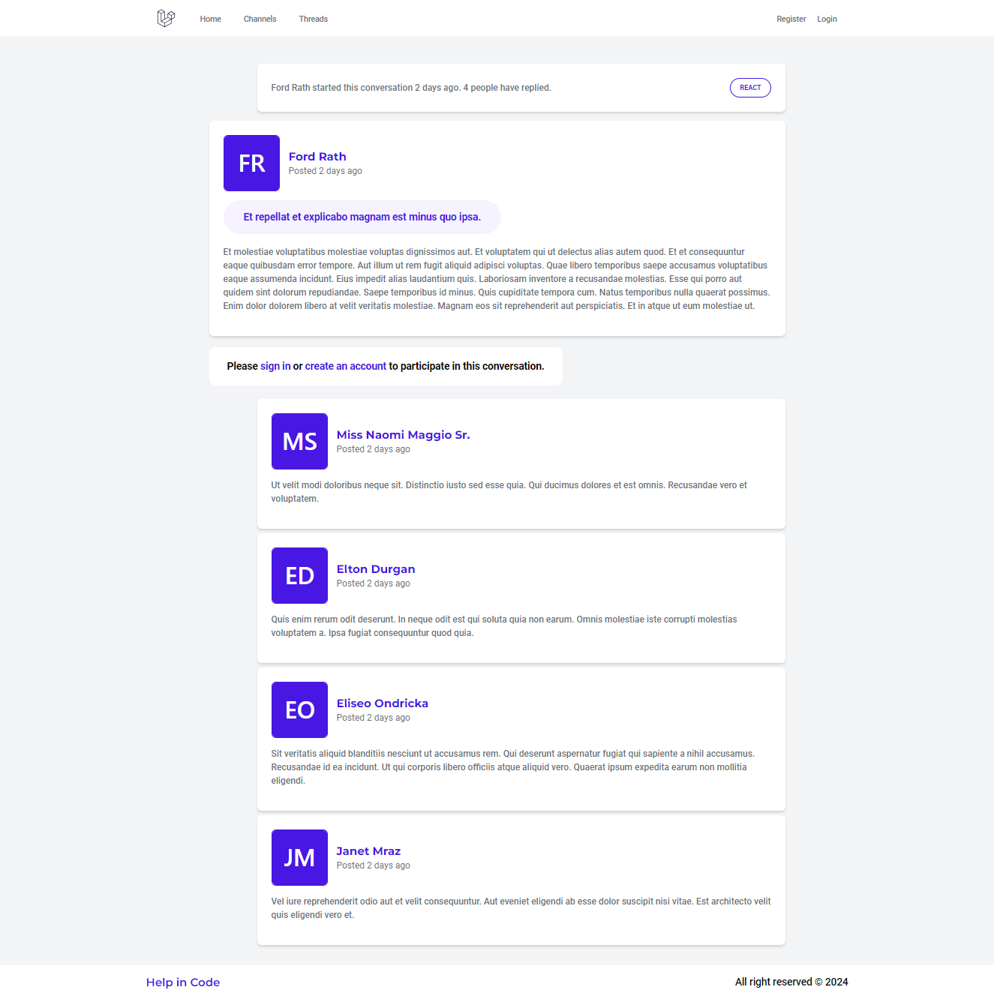

# Installation for Help in Code

Help in Code is real time forum website.
Create using laravel and livewire

## To deploy this project run

```bash
  npm run deploy
```


## Run Locally

Clone the project

```bash
git clone https://github.com/rajaammar557/HelpinCode.git
```

Go to the project directory

```bash
cd HelpinCode
```
Set Up Environment Variables

```bash
cp .env.example .env
```
Genrate key for application
```bash
php artisan key:generate
```
Run Migrations
```bash
php artisan migrate
```

Seed data
```bash
php artisan db:seed
```

Install node dependencies
```bash
npm install
```

Building assets

```bash
npm run build
```

Run Server
```bash
php artisan serve
```



